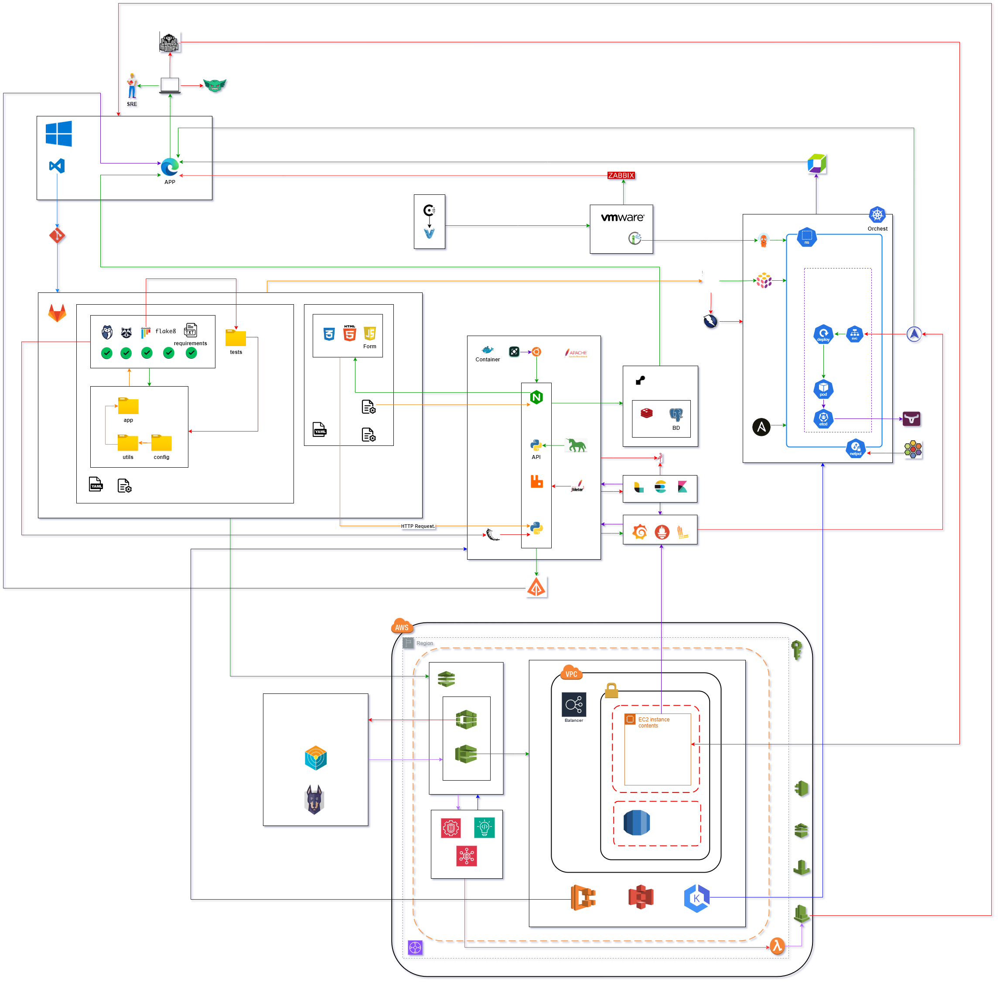

# Architecture Guide

## Contents

- [Architecture Guide](#architecture-guide)
  - [Contents](#contents)
  - [⚙️ System Overview](#️-system-overview)
  - [📊 Diagram](#-diagram)
    - [Components](#components)
  - [🚀 CI/CD Pipeline with Jenkins and AWS Integration](#-cicd-pipeline-with-jenkins-and-aws-integration)
    - [1. **Migrating Jenkins to AWS**](#1-migrating-jenkins-to-aws)
  - [🔐 DevSecOps Best Practices](#-devsecops-best-practices)
  - [🛡️ Key Practices](#️-key-practices)
    - [1. 🔍 Automated Security Testing](#1--automated-security-testing)
    - [2. 🛠️ Infrastructure as Code (IaC)](#2-️-infrastructure-as-code-iac)
    - [3. 🔑 Secret Management](#3--secret-management)
    - [4. ✅ Code Review and Approval Gates](#4--code-review-and-approval-gates)
  - [🔄 Example of Jenkins Pipeline with Security Testing](#-example-of-jenkins-pipeline-with-security-testing)
  - [3. ☁️ AWS Deployment](#3-️-aws-deployment)
    - [📝 Example CloudFormation for AWS Deployment](#-example-cloudformation-for-aws-deployment)
  - [🔎 Security Audits](#-security-audits)
  - [📊 CI/CD Pipeline Monitoring](#-cicd-pipeline-monitoring)
    - [📈 Example: Jenkins Pipeline with Monitoring Integration](#-example-jenkins-pipeline-with-monitoring-integration)
  - [📜 Logging](#-logging)
  - [🔐 Secret Management](#-secret-management)
  - [🐳 Docker Versioning](#-docker-versioning)
  - [🎯 General Objectives and Benefits](#-general-objectives-and-benefits)

---

## ⚙️ System Overview

**Target Audience**:
This architecture is designed for development teams focused on integrating security into their DevOps pipelines and leveraging cloud resources effectively.

**Use Case**:
The system uses **AWS** for scalable infrastructure and implements **Jenkins** for CI/CD automation. Key security considerations (DevSecOps) are integrated throughout the development pipeline to ensure compliance and security by default.

**DevSecOps Integration**:
DevSecOps is embedded into the CI/CD pipeline to ensure security is integrated at every stage of software development. This practice ensures that security is not an afterthought but an ongoing concern, from code commit to production deployment.

---

## 📊 Diagram

- This diagram visualizes how the components of the CI/CD pipeline are integrated and managed in the AWS ecosystem, with a focus on the migration of Jenkins and the adoption of DevSecOps practices.

- The **Jenkins server** (migrated to AWS) interacts with **AWS services** to manage the build and deployment pipelines. The CI/CD pipeline is enhanced with **security scans**, **automated tests**, and **infrastructure as code** to ensure security by default.

- The **browser** (where developers or testers trigger builds and deployments) communicates with the Jenkins server. This setup is supported by AWS services that handle the orchestration and scaling of the infrastructure.

- The data generated by Jenkins builds, logs, and security scans is stored and monitored using **AWS services** like **S3**, **CloudWatch**, and **Secrets Manager**.

### Components

1. **Frontend (CI/CD triggers from Jenkins)**: The interface through which users interact with Jenkins.

2. **Jenkins Server (AWS EC2 or ECS)**: Hosts Jenkins in a scalable, secure AWS environment.

3. **AWS Services (CloudFormation, EC2, S3, CloudWatch, Secrets Manager)**: Infrastructure services that support DevSecOps practices, including security scans, logging, and secret management.

4. **Docker Compose (Service Orchestration in AWS)**: Manages the deployment of Docker containers within the AWS environment, ensuring smooth orchestration of services.

- Use the tool **draw.io** to create this diagram, reflecting the AWS-based DevSecOps architecture.



---

## 🚀 CI/CD Pipeline with Jenkins and AWS Integration

### 1. **Migrating Jenkins to AWS**

When migrating Jenkins to AWS, the goal is to create a scalable, secure, and efficient Jenkins infrastructure. Below are the recommended steps:

- **AWS EC2 Instances**: Create EC2 instances to host Jenkins. Use **Amazon Linux 2** or **Ubuntu** images to deploy Jenkins.
- **Jenkins Scaling**: Leverage **AWS Auto Scaling Groups** to ensure Jenkins is horizontally scalable. This helps to automatically add/remove EC2 instances as demand increases or decreases.
- **Jenkins on ECS**: Alternatively, use **Amazon ECS** (Elastic Container Service) to run Jenkins in Docker containers, enhancing scalability and making the Jenkins setup more portable and manageable.
- **EFS for Storage**: Store Jenkins configuration, build data, and logs on **Amazon EFS** (Elastic File System) to ensure persistence and scalability without worrying about disk limits.

**Sample CloudFormation Template for Jenkins Deployment**:

```yaml
Resources:
  JenkinsInstance:
    Type: 'AWS::EC2::Instance'
    Properties:
      InstanceType: t2.medium
      ImageId: ami-xxxxxxxx
      KeyName: your-ssh-key
      SecurityGroups:
        - !Ref JenkinsSecurityGroup
      Tags:
        - Key: Name
          Value: JenkinsServer

```

---

## 🔐 DevSecOps Best Practices

**DevSecOps** practices ensure that security is integrated into every phase of the development lifecycle. Below are key practices for effectively integrating security:

## 🛡️ Key Practices

### 1. 🔍 Automated Security Testing

Integrate security scanning tools like **OWASP ZAP**, **SonarQube**, or **Trivy** into the Jenkins pipeline to perform static and dynamic analysis on the code and Docker images. These tools help detect vulnerabilities in the source code and container images before they reach production.

### 2. 🛠️ Infrastructure as Code (IaC)

Use **Terraform** or **CloudFormation** to define and manage resources in AWS. This ensures that security configurations (such as IAM roles, VPC configurations, security groups) are versioned, auditable, and repeatable. This allows for consistent and secure infrastructure management.

### 3. 🔑 Secret Management

Use **AWS Secrets Manager** or **HashiCorp Vault** to securely store and access secrets like API keys or database passwords within Jenkins and other services. This ensures that secrets are not exposed in code or infrastructure configuration.

### 4. ✅ Code Review and Approval Gates

Implement mandatory code reviews and approval steps in Jenkins to ensure that security considerations are addressed before the code is merged or deployed. This helps ensure that both automated and manual security checks are conducted during critical stages of the software lifecycle.

## 🔄 Example of Jenkins Pipeline with Security Testing

Below is an example of a Jenkins pipeline that integrates security testing:

```groovy
pipeline {
    agent any
    stages {
        stage('Checkout') {
            steps {
                checkout scm
            }
        }
        stage('Static Analysis') {
            steps {
                script {
                    sh 'sonar-scanner'
                }
            }
        }
        stage('Build Docker Image') {
            steps {
                script {
                    sh 'docker build -t myapp .'
                }
            }
        }
        stage('Security Scan') {
            steps {
                script {
                    sh 'trivy image myapp'
                }
            }
        }
        stage('Deploy to AWS') {
            steps {
                script {
                    sh './deploy.sh'
                }
            }
        }
    }
}

```

---

## 3. ☁️ AWS Deployment

To deploy the application on AWS, follow these steps:

- **Elastic Load Balancer (ELB)**: Use AWS ELB to distribute traffic across multiple EC2 instances, ensuring high availability and fault tolerance.
- **Amazon RDS**: Use Amazon RDS to manage relational databases (like PostgreSQL, MySQL) with automated backups and scalability.
- **Amazon S3**: Store static assets such as images, videos, or user-generated content in Amazon S3 for scalable and low-cost storage.
- **Amazon CloudWatch**: Monitor the application and infrastructure with CloudWatch to track metrics such as CPU utilization, disk I/O, and memory usage. Set up alarms to notify the team of any unusual behavior.

### 📝 Example CloudFormation for AWS Deployment

```yaml
Resources:
  MyRDSInstance:
    Type: 'AWS::RDS::DBInstance'
    Properties:
      DBInstanceIdentifier: mydb-instance
      DBInstanceClass: db.t2.micro
      Engine: mysql
      MasterUsername: admin
      MasterUserPassword: your-password
      AllocatedStorage: 20

```

---

## 🔎 Security Audits

Continuously monitor Jenkins to detect security vulnerabilities. Use tools like **Aqua Security** or **Anchore** to monitor container security in the CI/CD pipeline. These tools analyze Docker images and containers for vulnerabilities, ensuring that only secure images are deployed.

## 📊 CI/CD Pipeline Monitoring

Leverage **CloudWatch** and **Jenkins plugins** to monitor and log pipeline execution. Set up notifications for failed jobs or suspicious activities (such as unauthorized access attempts). CloudWatch can be used to create custom metrics for pipeline health, and Jenkins plugins can help with real-time alerts for build failures.

### 📈 Example: Jenkins Pipeline with Monitoring Integration

This is an example of how to integrate monitoring into a Jenkins pipeline to report deployment status to CloudWatch:

```groovy
pipeline {
    agent any
    environment {
        AWS_REGION = 'us-west-2'
    }
    stages {
        stage('Deploy to AWS') {
            steps {
                script {
                    // Deploy to AWS
                    sh './deploy.sh'
                    // Log deployment status
                    sh 'aws cloudwatch put-metric-data --metric-name DeploymentStatus --value 1 --namespace CI/CD --region $AWS_REGION'
                }
            }
        }
    }
}

```

---

## 📜 Logging

Integrate **CloudTrail** to audit AWS API calls and **Amazon GuardDuty** for threat detection. Ensure that **Jenkins logs**, **security tools logs**, and **AWS services logs** are aggregated in **Amazon Elasticsearch** for later analysis. This provides a centralized location for all logs, enabling quicker identification of security threats or failures.

---

## 🔐 Secret Management

Use **AWS Secrets Manager** to securely manage and rotate secrets. Integrating it with Jenkins ensures that sensitive data, like API keys and credentials, are protected while used in the CI/CD pipeline. Secrets Manager enables seamless rotation and access control to sensitive information.

---

## 🐳 Docker Versioning

Tag Docker images with version numbers that correspond to commits or release versions. This practice helps track deployments and ensures that you can perform rollbacks if needed. A good versioning strategy also allows you to easily identify which image was deployed at a given point in time.

---

## 🎯 General Objectives and Benefits

The main objectives of this architecture include:

1. **Scalability**: Through AWS services like EC2, RDS, and Auto Scaling, the system is designed to handle growth with minimal intervention.

2. **Security**: DevSecOps practices ensure security is integrated at every stage, from development to deployment. Automated security scans and monitoring tools protect against vulnerabilities.

3. **Automation**: Moving Jenkins to AWS enables efficient and automated CI/CD pipelines, improving the speed and reliability of development.

4. **Cost Efficiency**: By using AWS services like EC2, S3, and RDS, the infrastructure is optimized for cost and resource management, with automated scaling and storage management.

---
